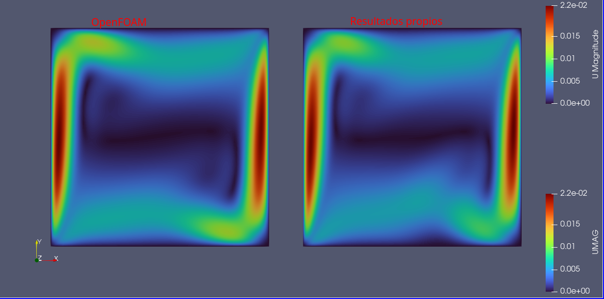

# inco_2D_flow

Este es un solver aún en desarrollo que tiene la capacidad de resolver los clásicos casos:

- lid driven cavity
- buoyancy driven cavity

Pudiendo rotar la cavidad (en el caso de buoyancy driven cavity) para observar los efectos gravitarios en el fluido. El solver aplica el Método de Volumen Finito de celdas colocadas (Moukalled et al. 2016) para resolver un flujo newtoniano laminar, viscoso, monofásico, incompresible, en estado estacionario y con fuerzas de cuerpo. Aunque al estar aún en pruebas no está exento de fallos.

# Dependencias.
- Sistema operativo Linux.
- GNU Fortran 13.3.0 (por lo menos).
- GNU Make 4.3 (mínimo)

# Uso
Luego de clonar el repositorio a la carpeta de tu preferencia, se puede poner a correr el solver con el siguiente comando:

```Shell
make && ./main
```

Para variar los parámetros se debe de ir al archivo `variables_globales.f90`.

